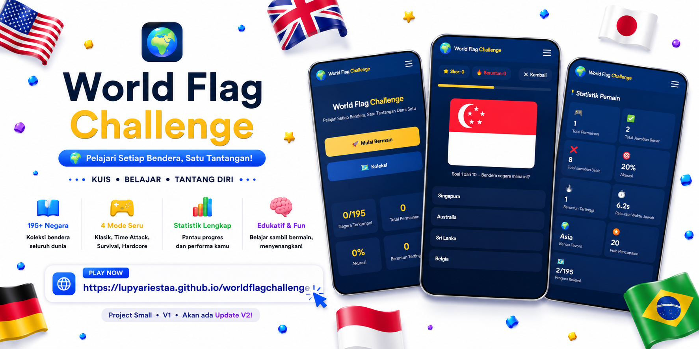
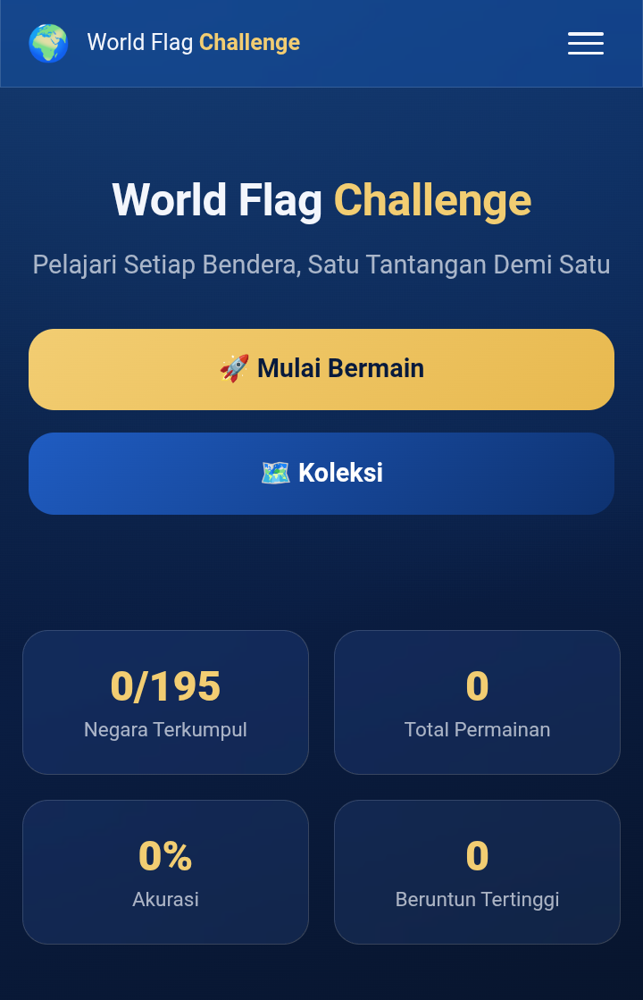
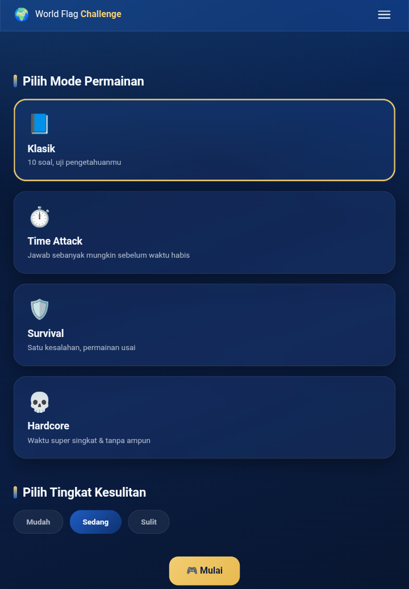
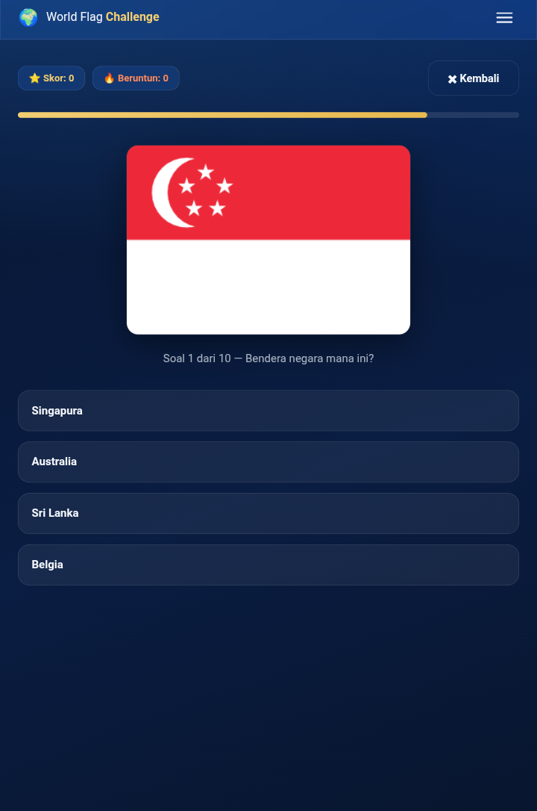
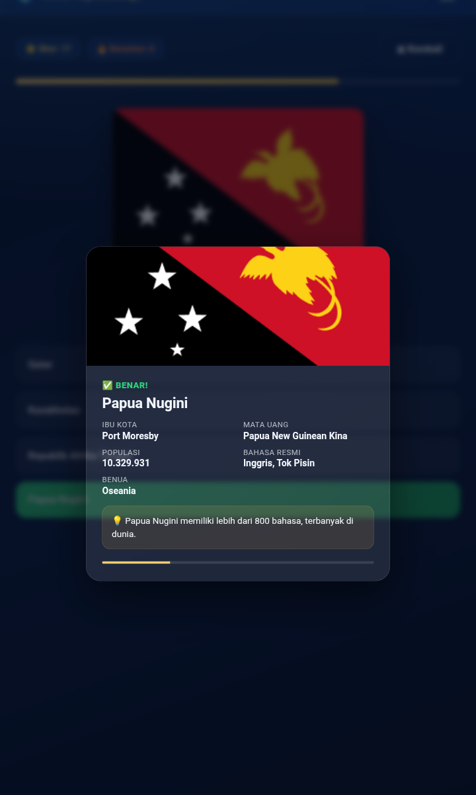
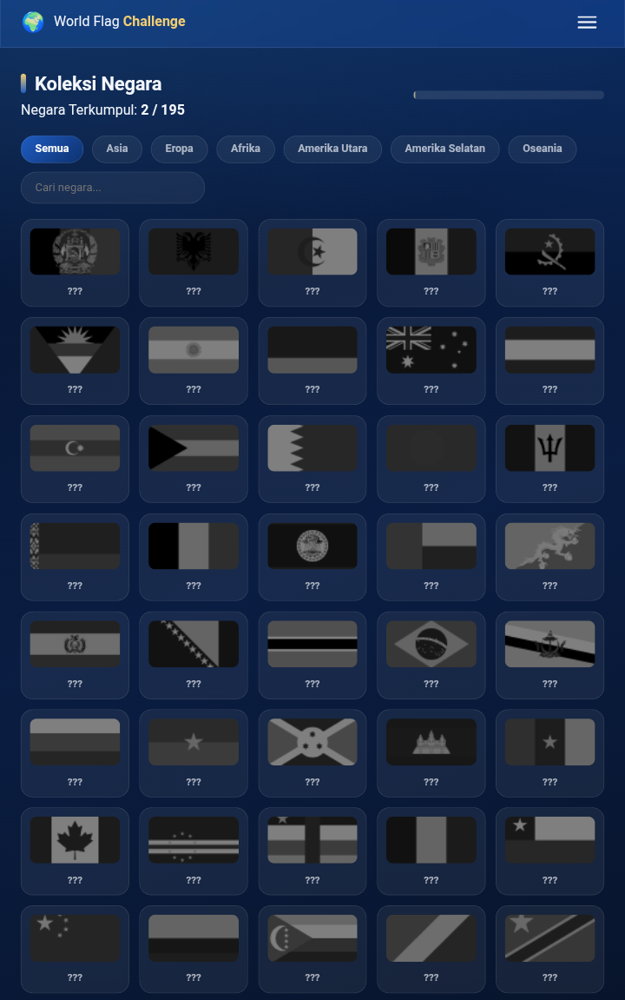
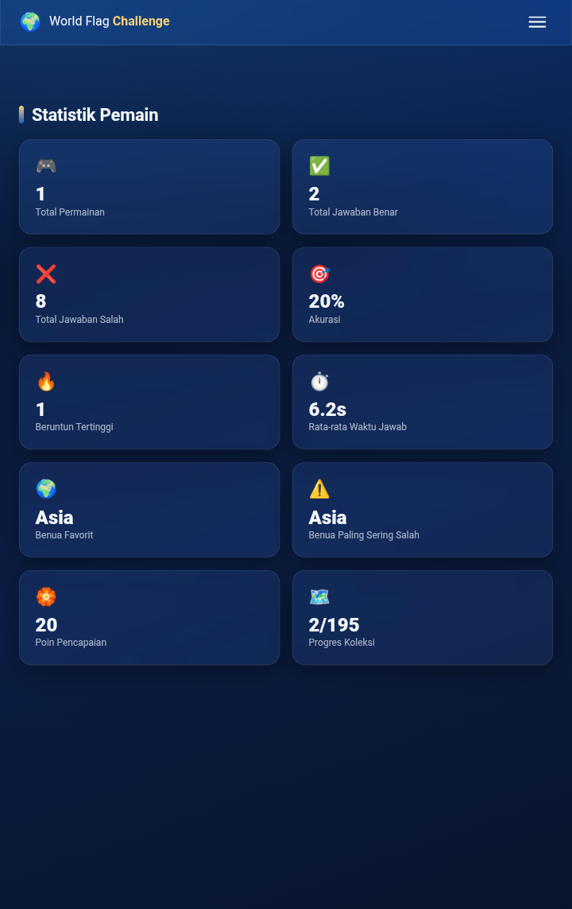

<div align="center">



# 🌍 World Flag Challenge

### Learn Every Flag • One Challenge at a Time

A modern geography quiz game that helps you recognize **195 country flags** through multiple game modes, achievements, statistics, and an interactive country collection.

<p>


</p>

## 🚀 Play Demo

### 👉 https://lupyariestaa.github.io/worldflagchallenge/

</div>

---

# 📖 About

**World Flag Challenge** adalah game edukasi berbasis web yang dirancang untuk membantu pemain mengenal bendera negara dari seluruh dunia dengan cara yang menyenangkan.

Game ini menghadirkan berbagai mode permainan, tingkat kesulitan, sistem statistik, pencapaian, hingga koleksi negara yang bisa dibuka seiring progres bermain.

---

# ✨ Features

- 🌍 195 World Flags
- 🎮 Multiple Game Modes
- ⚡ Time Attack Mode
- 💀 Hardcore Mode
- 🛡 Survival Mode
- 🎯 Multiple Difficulty Levels
- 📚 Country Collection
- 🏆 Achievement System
- 📊 Detailed Statistics
- 🌙 Dark / Light Theme
- 🌐 Multi Language
- 🔊 Sound & Music Settings
- 💾 Local Progress Save
- 📱 Responsive Design

---

# 📸 Screenshots

<div align="center">





<br><br>





</div>

> Replace these placeholder images with your own screenshots.

---

# 🎮 Game Modes

| Mode | Description |
|------|-------------|
| 📘 Classic | 10 questions to test your knowledge |
| ⏱ Time Attack | Answer as many as possible before time runs out |
| 🛡 Survival | One mistake ends the game |
| 💀 Hardcore | Very short timer with maximum challenge |

---

# 🌎 Difficulty Levels

- 🟢 Easy
- 🔵 Medium
- 🔴 Hard

Each difficulty adjusts the challenge to match your experience.

---

# 🏅 Achievement System

Unlock achievements while playing:

- 🎮 First Game
- 🔥 Win Streak
- 🎯 Accuracy Master
- 🌍 Geography Expert
- 👑 World Legend
- 💎 Encyclopedia Walker

...and many more!

---

# 📊 Statistics

Track your progress with:

- Total Games
- Correct Answers
- Wrong Answers
- Accuracy
- Highest Streak
- Average Answer Time
- Favorite Continent
- Collection Progress
- Achievement Points

---

# 🛠 Tech Stack

| Technology | Usage |
|------------|-------|
| HTML5 | Structure |
| CSS3 | Modern UI |
| JavaScript (ES6) | Game Logic |
| LocalStorage | Save Progress |
| GitHub Pages | Hosting |

---

# 📁 Project Structure

```text
WorldFlagChallenge/
│
├── assets/
│   ├── flags/
│   ├── icons/
│   └── audio/
│
├── css/
├── js/
├── screenshots/
├── index.html
├── README.md
└── LICENSE
```

---

# 🚀 Future Updates

- 🌐 More Languages
- 🏆 Online Leaderboard
- 👥 Multiplayer Quiz
- 📱 Better Mobile Experience
- 🎨 More Themes
- ☁ Cloud Save
- 🎵 Additional Sound Effects
- 📈 More Player Statistics

---

# ⭐ Support

If you enjoy this project, don't forget to give it a **Star ⭐** on GitHub.

Every star motivates me to continue creating more open-source projects.

---

<div align="center">

### Made with ❤️ by **Lupy Ariesta**

**Learn • Play • Explore the World**

⭐ Thank you for visiting this repository!

</div>
